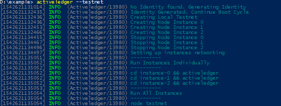
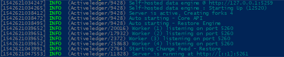
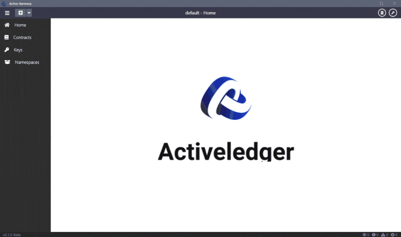

[](https://badge.fury.io/js/%40activeledger%2Factiveledger) 
[](https://www.npmjs.com/package/@activeledger/activeledger) 
[](https://lernajs.io/)
[](https://lbesson.mit-license.org/)


Activeledger is a powerful distributed ledger technology. Consider it as a single ledger updated simultaneously in multiple locations. As the data is written to a ledger, it is approved and confirmed by all other locations.

## Installation

Please see our documentation for detailed instructions. We currently have 2 languages available.

|Language| |
|--------|-|
|English| [documentation](https://github.com/activeledger/activeledger/tree/master/docs/en-gb/README.md)|
|Chinese| [说明文档](https://github.com/activeledger/activeledger/tree/master/docs/zh-cn/README.md)|


## Quickstart Guide

Use NPM to install the 3 main applications for running activeledger.

```bash
npm i -g @activeledger/activeledger @activeledger/activerestore @activeledger/activecore
```

##### Creating a local Activeledger testnet

Run the following command to create a 3 node local testnet.

```bash
activeledger --testnet
```



When the testnet has been created you can run all of them at once but running

```bash
node testnet
```

Alternatively you can run each instance of Activeledger independantly by navigating into the instance-x folders which have been created and running

```bash
activeledger
```


## Installing from GitHub Packages

As of v4.0.0, packages are published to the [GitHub Packages npm registry](https://github.com/orgs/activeledger/packages) rather than npmjs.com. GitHub Packages requires authentication for install even on public repositories, so add an `.npmrc` alongside your `package.json` (do not commit a real token):

```
@activeledger:registry=https://npm.pkg.github.com
//npm.pkg.github.com/:_authToken=${NODE_AUTH_TOKEN}
```

Then set `NODE_AUTH_TOKEN` to a GitHub personal access token with `read:packages` scope (a fine-grained token scoped to this org is fine) and install as normal:

```bash
export NODE_AUTH_TOKEN=<your github token>
npm i -g @activeledger/activeledger @activeledger/activerestore @activeledger/activecore
```

For a Docker build, pass the token in as a build secret (e.g. `--secret id=npmrc,src=.npmrc` with a `RUN --mount=type=secret,id=npmrc,target=/root/.npmrc npm i -g ...` step) rather than baking it into an image layer.

## Developer Tools

We have created an IDE for developers to create and manage Activeledger smart contracts across multiple networks. This IDE helps manage the private keys for developers to sign their contracts with and the namespaces their contracts will be stored under in each specific network. This tool is currently in beta but is available for Linux, Windows and OSX.

[IDE User Guide](https://github.com/activeledger/activeledger/tree/master/docs/en-gb/ide/README.md) | [用户指南](https://github.com/activeledger/activeledger/tree/master/docs/zh-cn/ide/README.md)



### IDE Download

Visit [Release section](https://github.com/activeledger/ide/releases)

## Building from source

### Prerequisites

We use [lerna](https://lernajs.io/) to manage this monorepo.
Make sure you have lerna installed.
If you use a package manager, install lerna with that. Otherwise:

```bash
npm install --global lerna
```

### Building

```bash
npm i
npm run setup
```

## License

[MIT](https://github.com/activeledger/activeledger/blob/master/LICENSE)
